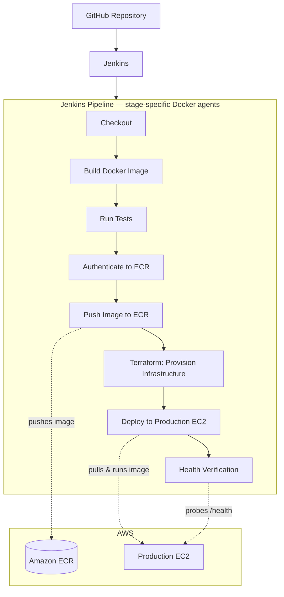

# Calculator App — CI/CD Pipeline

A small Python calculator service used as the delivery vehicle for a full
CI/CD build-out: containerized app → Jenkins pipeline → Amazon ECR →
Terraform-provisioned infrastructure → automated deploy to a production
EC2 host, gated by an HTTP health check before a release counts as live.

## Architecture



Each pipeline stage runs in its own Docker agent, scoped to exactly the
tools that stage needs (Python for build/test, AWS CLI for ECR/deploy,
`curl` for health checks) rather than relying on a shared Jenkins
environment having everything pre-installed. `agent none` is set at the
pipeline level for this reason — every stage declares its own agent.

## CI/CD Pipeline

1. Developer pushes code to GitHub (feature branch or `main`).
2. Jenkins' Multibranch Pipeline picks up the change via webhook.
3. Jenkins checks out the repository.
4. The Docker image is built (app code + dependencies baked in via the
   `Dockerfile`).
5. Automated tests (`pytest`) run inside the built image; results are
   published as JUnit reports and archived as build artifacts.
6. Jenkins authenticates to Amazon ECR (`aws ecr get-login-password` →
   `docker login`).
7. The image is pushed to ECR — PR builds get a `pr-<id>-<build>` tag;
   merges to `main` get `release-<build>` and `latest`.
8. *(main only)* Terraform provisions/updates the required AWS
   infrastructure.
9. *(main only)* The new image is deployed to the production EC2 host over
   SSH (pull, stop old container, run new one).
10. *(main only)* Jenkins runs an HTTP health check against `/health` with
    retries — the pipeline fails the build if the check doesn't pass.
11. Jenkins reports overall pipeline success/failure.

Pull requests run steps 1–7 only (CI). Merges to `main` run the full
1–11 flow (CD).

## Infrastructure as Code

Terraform manages the AWS side of this project in two layers:

- **Currently live:** the ECR repository (root `main.tf`) — this is what
  the pipeline's Provision Infrastructure stage actually applies today.
- **In progress:** an expanded `terraform/` config that additionally
  manages the production EC2 instance, its security group, an IAM
  instance role (so the host can authenticate to ECR itself), and a
  remote S3 state backend. It's written and syntax-checked but not yet
  applied against the live account.

The standard Terraform workflow is:

```text
terraform init
terraform validate
terraform plan
terraform apply
```

What the Jenkinsfile actually automates is narrower than that: the
Provision Infrastructure stage runs `terraform init` followed by
`terraform apply -auto-approve` inside a `hashicorp/terraform` container.
There's no `validate` or `plan`-then-review gate in the pipeline yet —
changes apply directly. `plan` is run manually when reviewing infrastructure
changes before they're merged.

## AWS / Container Workflow

The app is packaged as a single Docker image built from the repo's
`Dockerfile`. The image is versioned by Jenkins build metadata (PR-scoped
tags for CI, `release-<build>`/`latest` for CD) and pushed to a private
Amazon ECR repository. The production host pulls the `latest` tag on
deploy and runs it as a standalone container, mapping host port 80 to the
container's port 5000.

## Troubleshooting & Lessons Learned

Real problems encountered while building this out — documented because
debugging a broken pipeline is most of what the job actually is.

**1. Terraform / Docker filesystem and mount mismatch.** Early on,
Terraform was running inside a Docker-based Jenkins execution environment
where the expected workspace/filesystem access wasn't correctly aligned —
a path visible on the Jenkins host isn't automatically visible inside a
container unless it's explicitly mounted. Fixed by being explicit about
which volumes each Terraform container needed, rather than assuming
Docker-in-Docker would just see the host workspace.

**2. AWS CLI missing from the execution environment.** A pipeline run
reached the ECR push stage with AWS credentials correctly injected by
Jenkins (`withCredentials` masking confirmed they were present), but
`aws ecr get-login-password` failed with `aws: not found`. Credentials
being configured and a tool being installed are two separate concerns —
having the former doesn't guarantee the latter. Fixed by running that
stage in a dedicated `amazon/aws-cli` Docker agent instead of assuming the
Jenkins node had the CLI installed.

**3. ECR authentication / Docker login failure.** Related to #2: before
the AWS CLI was properly available in the right environment, `docker
login --password-stdin` against the ECR registry returned a
`400 Bad Request`. The expected chain is AWS credentials → AWS CLI →
`get-login-password` → `docker login` → `docker push` → ECR, and the
break was at the CLI-availability boundary described above, not a
credentials or IAM problem as far as the logs showed.

**4. Jenkins Git configuration warning.** Every run logs `Selected Git
installation does not exist. Using Default` / `recommended git tool is:
NONE`. This looks alarming but isn't the actual failure — Jenkins falls
back to a default Git and `checkout` still succeeds. Worth knowing so it
doesn't get chased as a red herring.

**5. Health Verification — a Groovy/Bash quoting bug, not a missing
tool.** The Health Verification stage was already using `curlimages/curl`
and curl was never missing. The real cause was a Groovy string-escaping
issue: the shell block was written as a Groovy triple-double-quoted
string (`"""..."""`), which Groovy interpolates before the shell ever sees
it. It contained `\\\$(seq 1 5)`, which Groovy collapses to `\$(seq 1 5)`
— an escaped, literal `$` followed by a bare `(`, which is a shell syntax
error (`unexpected "("`). The fix was switching that block to a
Groovy triple-*single*-quoted string (`'''...'''`), so Groovy performs no
interpolation and the shell resolves `$(...)` and `$VAR` itself. The
lesson: embedding Bash inside a Jenkinsfile means two interpolation layers
(Groovy, then shell) exist whether you intend it or not, and escaping has
to account for both.

## Key DevOps Lessons

- 🗂️ **Problem:** A container doesn't see the host's filesystem by magic.
  **Fix:** Mount volumes explicitly instead of assuming Docker-in-Docker
  shares the Jenkins workspace.
- 🔑 **Problem:** Credentials were injected correctly, but the CLI that
  needed them wasn't installed. **Fix:** Give each stage its own
  purpose-built Docker agent (`amazon/aws-cli`, `curlimages/curl`, etc.)
  instead of relying on a shared environment.
- 🔒 **Problem:** `docker login` to ECR failed with a 400. **Fix:** Traced
  it to the missing-CLI issue above — same root cause, different symptom.
- 🧩 **Problem:** Groovy and Bash both interpret `$` and quotes — escaping
  for one broke the other. **Fix:** Use Groovy triple-single-quotes
  (`'''...'''`) for shell blocks so only Bash touches `$()`/`$VAR`.
- 🐛 **Problem:** A scary Jenkins log line (`Selected Git installation does
  not exist`) turned out to be a harmless warning. **Fix:** Learned to
  check whether the *stage actually failed* before chasing a log line.
- 🎯 **Takeaway:** When a pipeline breaks, find which layer failed —
  Groovy → Jenkins → shell → Docker → AWS — before assuming the top error
  message is the root cause.

## Technologies

| Technology | Purpose |
|---|---|
| GitHub | Source control, webhook-triggered builds |
| Jenkins | CI/CD orchestration (Multibranch Pipeline) |
| Docker | Containerization / isolated, stage-specific CI environments |
| Terraform | Infrastructure as Code (ECR, and in progress: EC2/IAM/networking) |
| Amazon ECR | Container image registry |
| AWS (EC2) | Cloud infrastructure / production host |
| Python | Application language (calculator logic + health API) |
| pytest | Unit and integration testing |
| Bash | Deployment and health-check scripting |
| Groovy | Jenkinsfile pipeline definition |

## Project Structure

```
.
├── Jenkinsfile                # CI + CD pipeline definition
├── Dockerfile                 # app container image
├── api.py                     # health endpoint
├── calculator_app.py          # stateful calculator app
├── calculator_logic.py        # pure calculator functions
├── requirements.txt
├── tests/
│   ├── test_calculator_logic.py
│   └── test_calculator_app_integration.py
├── main.tf                    # currently live: ECR repo only
└── terraform/                 # in progress: full infra as code
    ├── main.tf                # backend + provider
    ├── variables.tf
    ├── ecr.tf
    ├── security_group.tf
    ├── iam.tf
    ├── ec2.tf
    ├── README.md               # setup + migration notes
    └── bootstrap/
        └── main.tf             # one-time: S3 state bucket + DynamoDB lock table
```

## What I Learned

This project moved me past "how do I write a Jenkinsfile" into the more
useful question of *where a pipeline is actually executing and what that
environment contains*. Most of the real debugging here wasn't about
pipeline syntax — it was about environment boundaries: Jenkins node vs.
Docker agent, Groovy vs. shell, credentials vs. installed tooling.
Building each stage around an explicit, minimal Docker agent turned out to
be the fix for almost every category of failure encountered, and it's the
pattern I'd default to on future pipelines.
